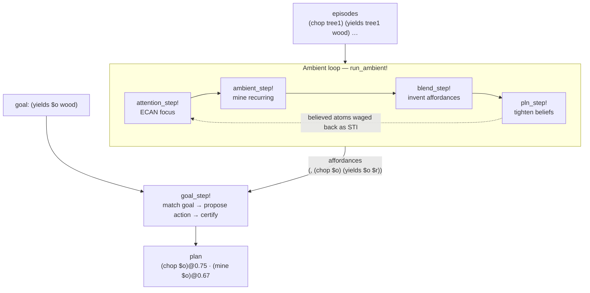

# Scenario: Affordance Discovery

This scenario is the smallest end-to-end demonstration of the two-loop cognitive cycle doing real work.
It is grounded in vibe-engineering Appendix A §A.8 (Scenario A: Minecraft affordance discovery): an agent
watches a stream of game-state episodes, the **ambient loop** spots recurring action→outcome regularities
and invents composite *affordances*, and the **goal-directed loop** then uses those affordances to plan
toward a goal — each proposal certified against the substrate.

The runnable script is [`examples/scenario_affordance.jl`](https://github.com/CognitiveSubstratesAI/WorldModel/blob/main/examples/scenario_affordance.jl).
It needs a backend; the example uses the in-process `MeTTaCore` adapter
([`examples/mettacore_backend.jl`](https://github.com/CognitiveSubstratesAI/WorldModel/blob/main/examples/mettacore_backend.jl)),
but any [`AbstractBackend`](@ref) works.

## The two loops, composing



## What the agent perceives

A small symbolic game-state log — repeated `chop → wood` and `mine → stone` episodes:

```julia
const AFFORDANCE_DATA = join([
    "(chop tree1)", "(yields tree1 wood)",
    "(chop tree2)", "(yields tree2 wood)",
    "(chop tree3)", "(yields tree3 wood)",
    "(mine rock1)", "(yields rock1 stone)",
    "(mine rock2)", "(yields rock2 stone)",
], "\n")

const CANDIDATES = [raw"(chop $o)", raw"(mine $o)", raw"(yields $o $r)"]
```

## Ambient loop — discovering affordances

[`run_ambient!`](@ref) runs one self-feeding ambient cycle (ECAN → mining → blending → factor-PLN) and
threads each output into the next:

```julia
using WorldModel
include(joinpath(pkgdir(WorldModel), "examples", "scenario_affordance.jl"))

run_affordance_demo()
```

```text
── cycle 1 ──
  recurring (mined):    ["(chop $o)", "(mine $o)", "(yields $o $r)"]
  affordances (blends): ["(, (chop $o) (yields $o $r))", "(, (mine $o) (yields $o $r))"]
  beliefs:              [("(chop $o)", 0.75), ("(mine $o)", 0.67), ("(yields $o $r)", 0.83)]
```

The loop **mined** the three recurring patterns, **blended** the two that share the object variable into
composite affordances — *"chopping affords yielding"* and *"mining affords yielding"* — and assigned each
a count-based belief. No affordance was hand-written; they fall out of the episodes.

## Goal-directed loop — planning toward a goal

[`goal_step!`](@ref) takes a goal (the desired outcome — the MetaMo *motive*), backward-looks-up the
discovered affordances whose outcome matches it, proposes their action as a program, and certifies each
against the substrate (support of the affordance body → confidence):

```julia
run_goal_demo(raw"(yields $o wood)")   # "get wood"
```

```text
goal:        (yields $o wood)
affordances: ["(, (chop $o) (yields $o $r))", "(, (mine $o) (yields $o $r))"]
plan:        [("(chop $o)", 0.75), ("(mine $o)", 0.67)]
```

Given the goal *get wood*, the agent proposes **chopping** (certified 0.75) ahead of **mining** (0.67) —
the two loops composing: the ambient loop *discovers* what actions afford, and the goal loop *uses* that
knowledge to act, preferring the better-supported option.

## Minimal by design

Each step is the smallest substrate-native slice of its §4 component — enough to make the scenario run
honestly, not the full algorithm. Richer slices (Hebbian spreading-activation for ECAN, full
Fauconnier–Turner colimit blending, factor-graph PLN propagation, PLN backward chaining and PC forecasting
for the goal loop) live in the substrate libraries and are wired in only when a scenario measurably needs
them. See the [Architecture Decision](decisions.md) for the built-vs-spec map.
